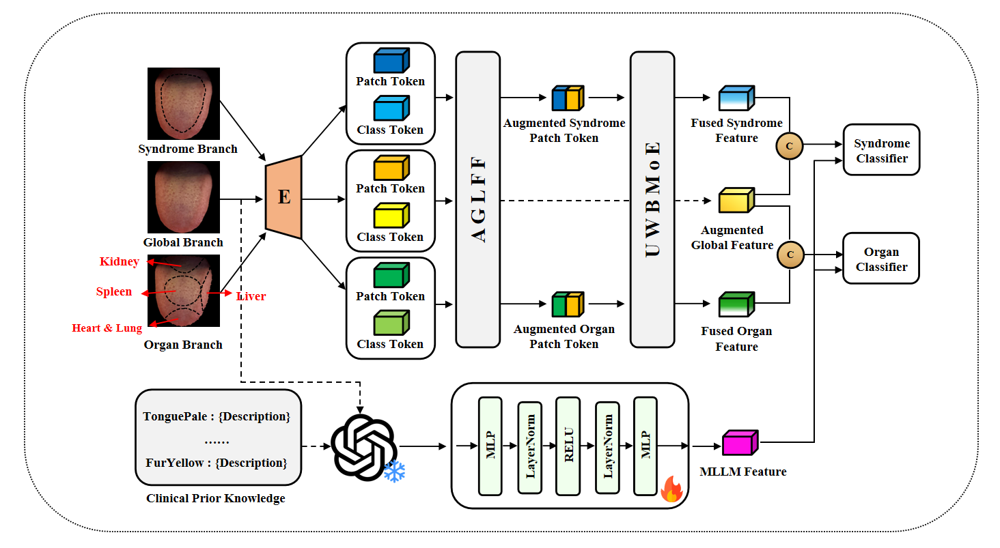
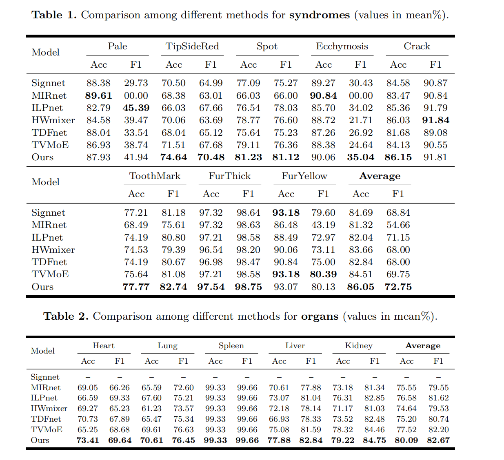
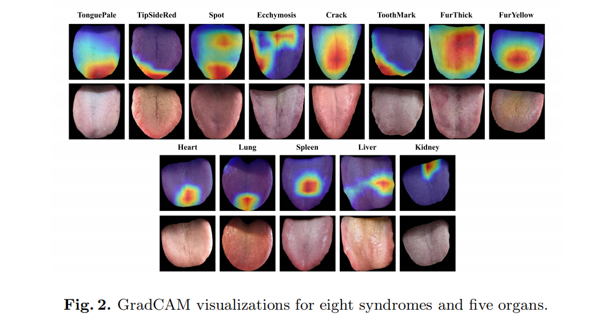

# CycleTCM

**MLLM-Enhanced Region-Aware Bidirectional Evidence-Based Model for Tongue Diagnosis**

*MICCAI 2026*

CycleTCM is a deep learning framework for computerized tongue diagnosis in Traditional Chinese Medicine (TCM). It jointly predicts **8-class syndrome** labels (e.g., tongue color, coating, fissure) and **5-class organ** labels (Heart, Lung, Spleen, Liver, Kidney) from multi-region tongue images, using a region-aware pipeline with bidirectional syndrome–organ reasoning.

---

## Table of Contents

- [Overview of Framework](#-overview-of-framework)
- [Experimental Results](#-experimental-results)
- [Visualization](#-visualization)
- [Getting Started](#-getting-started)
- [Citation](#-citation)

---

## Overview of Framework

The pipeline is **region-aware** and **evidence-based**: raw tongue images are first decomposed into semantically meaningful regions (tongue body/edge for syndrome, and heart–lung, spleen, liver, kidney regions for organ), then fed into separate backbones and fused with whole-image context. Syndrome and organ branches interact via **cross-attention**, **patch-wise similarity** with uncertainty weighting, and a **bidirectional Mixture-of-Experts (MoE)** so that each task is refined by the other.

Main components:

- **Input regions**: whole tongue, tongue edge + body (syndrome), and four organ regions (heart–lung, spleen, liver, kidney).
- **Backbones**: ResNet50-style encoders for syndrome (6-channel), organ (12-channel), and whole image.
- **Fusion**: Gated fusion of region features with whole-image features; cross-attention from whole to syndrome/organ class tokens.
- **Syndrome–organ interaction**: Cosine similarity between patch embeddings → uncertainty-based weighting → bidirectional MoE (syndrome→organ, organ→syndrome) for refined features.
- **Heads**: Two classifiers output 8-dimensional (syndrome) and 5-dimensional (organ) logits with weighted BCE for class imbalance.

<p align="center">
  
</p>
<p align="center">
  <em>Overall architecture: region decomposition, multi-branch encoding, cross-attention, uncertainty-weighted fusion, and bidirectional MoE.</em>
</p>

---

## Experimental Results

We report mean accuracy, F1, AUC, and MCC for both syndrome and organ prediction. The model is trained with weighted binary cross-entropy to handle class imbalance and evaluated on a held-out test set.

<p align="center">
  
</p>
<p align="center">
  <em>Quantitative results: syndrome and organ metrics (accuracy, F1, AUC, MCC) and per-class performance.</em>
</p>

---

## Visualization

Qualitative visualizations illustrate region segmentation, feature responses, or prediction outcomes on sample tongue images. These help interpret how the model uses different regions and how syndrome and organ predictions align with clinical intuition.

<p align="center">
  
</p>
<p align="center">
  <em>Visualization of region usage, attention, or prediction examples on tongue images.</em>
</p>

---

## Getting Started

### Environment

- Python 3.8+
- PyTorch 1.x / 2.x
- See `requirements.txt` (or install dependencies from `train/train.py` and `models/model.py`)

### Data

- Place tongue images and JSON labels under `data/` (e.g., `data/labels/json/` with `train_dataset.json`, `val_dataset.json`).
- Use the provided data preprocessing scripts in `data_preprocessed/` for region segmentation (tongue body/edge, organ regions) if needed.

### Training

```bash
bash bash_run.sh
# or
python train/train.py --output_log cross_validation_cycletcm.log
```

Training logs and summary statistics (syndrome/organ mean accuracy, F1, AUC, MCC) are written to the specified log file and console.

---

## Citation

If you use this code or idea in your work, please cite:

```bibtex
@inproceedings{cycletcm2026,
  title     = {MLLM-Enhanced Region-Aware Bidirectional Evidence-Based Model for Tongue Diagnosis},
  author    = {...},
  booktitle = {MICCAI},
  year      = {2026}
}
```

---

<p align="center">
  <sub>CycleTCM — Region-aware tongue diagnosis with bidirectional syndrome–organ reasoning</sub>
</p>
